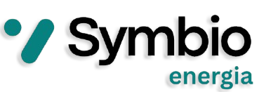

<p align="center">
  
</p>

<h2 align="center">SymbioEnergia IA</h2>

<p align="center">
  <strong>Consultor energético autónomo para polígonos industriales — IA agéntica, datos 100% abiertos, privacidad garantizada</strong><br>
  <em>Una PYME sin presupuesto para auditorías energéticas obtiene en segundos lo mismo que una gran empresa paga 15.000 €</em>
</p>

<p align="center">
  <a href="LICENSE"></a>
  
  
  
  
  
  
</p>

---

> **El IPCC lo tiene claro:** rebasar los 1,5 °C de calentamiento global activa riesgos severos e irreversibles — desintegración de casquetes polares, pérdida de arrecifes de coral, deshielo del permafrost con retroalimentaciones incontrolables. **2030 es el punto de inflexión.** Si para entonces no se ha reducido drásticamente la dependencia de los combustibles fósiles, el proceso se vuelve autónomo. No es un plazo político. Es física.

---

## El problema

Las empresas industriales de España **gastan de media un 35% más en energía de lo necesario** porque no tienen acceso a asesoramiento energético personalizado. Una auditoría profesional cuesta entre 5.000 € y 20.000 €, tarda semanas y requiere visita técnica. Las 3.500 pymes de los polígonos industriales de Aragón no pueden permitírselo.

Y sin embargo, **la voluntad existe**:

| Dato | Valor | Fuente |
|------|-------|--------|
| PYMES con uso directo de energía verde | **40,2%** | Informe sostenibilidad PYME 2025 |
| PYMES con medidas de eficiencia energética | **46,8%** | Informe sostenibilidad PYME 2025 |
| PYMES con contrato 100% electricidad verde | **~20.000** en España | CNMC / comercializadoras |
| Empresas medianas que mantendrán o aumentarán inversión en sostenibilidad | **84%** | Informe sostenibilidad PYME 2025 |
| Empresas grandes que ya usan renovables | **55%** | Informe grandes empresas 2025 |

El problema no es falta de voluntad — es falta de herramientas. El 84% quiere actuar. Solo el 40% lo consigue. La brecha es de acceso a información, no de intención.

Mientras tanto, todos los datos necesarios para ese análisis son **públicos y gratuitos**: geometría de edificios (OSM), radiación solar (PVGIS, Comisión Europea), precios eléctricos (OMIE), subvenciones (BOE/BOA/IDAE). Solo hace falta la IA para integrarlos.

## La solución

<p align="center">
  <strong>Cada nave industrial es una central energética esperando ser activada.</strong><br>
  SymbioEnergia IA la convierte en un activo rentable — ROI calculado, subvenciones identificadas,<br>
  contrato de comunidad energética generado y cifras listas para el banco.<br><br>
  <strong>30 segundos · Sin visita técnica · Sin consultoría · Sin coste</strong>
</p>

---

<table>
<tr>
<td width="50%" valign="top">

**Qué es:** una plataforma de IA agéntica que orquesta 6 agentes especializados en paralelo. Das unas coordenadas GPS y obtienes un plan de acción completo con documentos listos para usar.

</td>
<td width="50%" valign="top">

**Por qué es diferente:** primera herramienta open source que combina LiDAR de cubierta + PVGIS (JRC, UE) + comunidades energéticas RD-ley 7/2026 + subvenciones en tiempo real + **HRIA integrada en el algoritmo** — no como trámite final.

</td>
</tr>
</table>

---

### Lo que obtiene la PYME en menos de 30 segundos

<table>
<tr>
<th align="center">🛰️ Análisis LiDAR</th>
<th align="center">☀️ Potencial solar real</th>
<th align="center">🤝 Red energética</th>
</tr>
<tr>
<td align="center">Área útil · kWp máx<br>Pendiente y orientación<br>Nube de puntos 3D</td>
<td align="center">Producción mes a mes<br>20 años de datos satelitales<br>PVGIS (JRC, UE)</td>
<td align="center">Vecinos en 5 km<br>Coeficientes de reparto<br>Bizum energético mensual</td>
</tr>
<tr>
<th align="center">💶 Subvenciones</th>
<th align="center">📊 Viabilidad económica</th>
<th align="center">📄 Documentos listos</th>
</tr>
<tr>
<td align="center">BOE · BOA · IDAE<br>Horizon · LIFE · FEDER<br>InvestEU · REPowerEU</td>
<td align="center">ROI · Payback · VAN · TIR<br>Sizing óptimo kWp<br>Escenario ICO incluido</td>
<td align="center">Contrato CE (RD-ley 7/2026)<br>Factura liquidación mensual<br>Informe ejecutivo IA</td>
</tr>
</table>

---

### Más allá del análisis: herramientas de acción directa

La plataforma no se queda en el diagnóstico — genera documentos y respuestas accionables:

- 📝 **Contrato CE auto-generado** — borrador de estatutos RD-ley 7/2026 con cláusulas legales, coeficientes de reparto y firmantes. Listo para imprimir y llevar al notario.
- 💸 **Factura "Bizum energético"** — liquidación mensual real de la comunidad energética: producción vs. consumo por participante, desglosada en € a precio de pool OMIE.
- 📊 **Sube tu factura PDF** — la IA extrae kWh, coste y tarifa contratada y recalcula el análisis con tus datos reales. Sin formularios. Datos sensibles anonimizados antes de procesarse.
- 📋 **Informe ejecutivo estructurado** — nivel de oportunidad (ALTO/MEDIO/BAJO), plan financiero, subvenciones aplicables, riesgos HRIA y conclusión accionable. Imprimible, presentable a inversores.
- 🤖 **SymbioBot** — pregunta en lenguaje natural sobre cualquier aspecto del análisis y obtén respuesta inmediata con los datos de tu nave como contexto.

---

## Capturas de pantalla

### Landing Page · Polígonos Industriales Autosostenibles
> Propuesta de valor · Acceso directo al mapa 3D · Vista de escritorio


---

### Mapa de la Red Energética
> Mapbox GL JS Standard style · Edificios extruidos con altura real (Overpass API/OSM) · Vista crepuscular con sombras físicas reales · Búsqueda M3 con Nominatim


Haz clic en cualquier nave del polígono → footprint real capturado desde Mapbox streets-v8 → análisis instantáneo.

---

### Viewer 3D · Estudio del Edificio
> Three.js · Footprint real del edificio desde Mapbox streets-v8 · Modos: General, Solar, Sombras, Paneles, LiDAR · HUD de generación solar animado en tiempo real


---

### Agente Geo-Scanner · Análisis LiDAR de Cubierta
> Geometría del edificio calculada desde **Overpass API (OSM)** · Nube de puntos **LiDAR procedimental** inspirada en datos PNOA-IGN · Área útil, capacidad máxima kWp, pendiente y orientación del tejado


| Dato mostrado | Fuente | Nivel confianza |
|---------------|--------|-----------------|
| Área total / útil | OpenStreetMap · Overpass API | Alta (OSM real) |
| Capacidad solar (kWp) | Cálculo sobre footprint OSM | Alta |
| Altura del edificio | Overpass API (`building:height`) | Alta |
| Pendiente y orientación | Estimación geométrica | Media |
| Nube de puntos LiDAR | Simulación procedimental PNOA-IGN | Simulada (declarada) |

---

### Agente Clima · Potencial Solar y Climático
> Irradiación solar real: **PVGIS (Joint Research Centre, Comisión Europea)** · Temperatura y viento: **Open-Meteo ERA5 (ECMWF)** · Producción mensual desglosada


**Por qué PVGIS y no otra fuente:** el JRC es el organismo científico de la Comisión Europea para energía renovable. Sus datos son la referencia institucional de la UE para proyectos fotovoltaicos, con calibración satelital desde 2005. Confianza máxima declarada en la UI.

---

### Agente Simbiosis · Red Energética del Polígono
> Matching de empresas vecinas en radio **5 km** (RD-ley 7/2026) · **"Bizum energético"** — balance mensual kWh · Contrato CE auto-generado · Evaluación HRIA integrada


El agente verifica **antes de recomendar**: ruido de aerogeneradores en zonas residenciales, sombras sobre vecinos, barreras digitales para PYMES. HRIA score: 0–100. Si los datos son insuficientes, el sistema lo declara explícitamente.

---

### Agente Normativa · Subvenciones Aplicables
> Convocatorias actualizadas desde **BOE, BOA (Aragón), IDAE** y programas europeos (Horizon, LIFE, FEDER/PREAR, InvestEU, REPowerEU)


| Programa | Importe máx. | Fuente |
|----------|-------------|--------|
| STEP Aragón 2026 | 500.000 € | BOA |
| Incentivos Autoconsumo Compartido DCAA | 160.000 € | BOA |
| MOVES III Singulares | 40% inversión | BOE / IDAE |
| Línea ICO Empresas y Emprendedores | 12.500.000 € | ICO |
| Programas europeos (Horizon, LIFE…) | Variable | CORDIS / CE |

---

### Agente Financiero · Viabilidad Económica
> ROI, payback, VAN a 15 años y TIR · Sizing óptimo de instalación · Precios eléctricos **pool OMIE** (mercado ibérico) · Escenario de financiación bancaria incluido


Ejemplo real (Polígono Industrial Teruel Norte, 185.000 kWh/año):

| Indicador | Valor | Con subvención STEP |
|-----------|-------|---------------------|
| Capacidad óptima | 73 kWp | — |
| Inversión total | 76.650 € | 45.990 € neta |
| Payback | 6,1 años | **3,6 años** |
| VAN 15 años | 100.452 € | — |
| TIR | 27,9% | — |
| Ahorro neto/año | **12.662 €** | — |

---

---

## Cómo se integra la IA

SymbioEnergia no usa la IA como chatbot decorativo. Es el núcleo funcional de la plataforma:

```
Usuario hace clic en un edificio del mapa
           │
           ▼
  6 Agentes IA en paralelo (Promise.all, AbortController 18s)
  ┌─────────────────────────────────────────────────────────┐
  │  Agente Geo       → LiDAR + footprint OSM               │
  │  Agente Clima     → PVGIS JRC + Open-Meteo ERA5         │
  │  Agente Simbiosis → Matching vecinos RD-ley 7/2026      │
  │  Agente Normativa → BOE/BOA/IDAE + 5 programas UE      │
  │  Agente Financiero→ OMIE + ROI/payback/VAN/TIR          │
  │  Agente Renovables→ Solar/eólica/biomasa/mini-hidro     │
  └─────────────────────────────────────────────────────────┘
           │
           ▼
  Anonimización PII (Presidio + regex) ← AI Act compliance
           │
           ▼
  LLM: Ollama local (privado) → GROQ LLaMA-3.3-70b → fallback estructurado
           │
           ▼
  Informe ejecutivo con trazabilidad completa:
  fuente de dato + nivel de confianza + fecha de consulta
```

**Cadena de proveedores LLM** — privacidad por diseño:
- **Ollama local** (localhost:11434): los datos nunca salen del servidor. Prioridad 1.
- **GROQ cloud** (LLaMA-3.3-70b): activado solo si Ollama no está disponible. Datos anonimizados antes de enviar.
- **Fallback estructurado local**: siempre disponible. Sin dependencias de red.

---

## Instalación

### Requisitos previos

- Python 3.11+
- MySQL 8.x (XAMPP recomendado en Windows, MySQL nativo en Linux/macOS)
- Git
- Token gratuito de Mapbox ([mapbox.com](https://www.mapbox.com))

### Paso a paso

```bash
# 1. Clonar el repositorio
git clone https://github.com/Oscarr36/SymbioEnergia-IA.git
cd SymbioEnergia-IA

# 2. Entorno virtual
python -m venv .venv
.venv\Scripts\activate        # Windows
# source .venv/bin/activate   # Linux/macOS

# 3. Dependencias
pip install -r requirements.txt

# 4. Configurar variables de entorno
cp config/.env.example config/.env
# Editar config/.env — mínimo obligatorio: FLASK_SECRET_KEY y MAPBOX_TOKEN
```

### Base de datos

```bash
# MySQL debe estar corriendo (XAMPP → Start MySQL, o mysqld)
python scripts/db_init.py
# Crea la BD, aplica el schema (10 tablas con FK), siembra usuario demo
```

### Arrancar

```bash
python run.py
# → http://localhost:5000
```

### Variables de entorno

| Variable | Descripción | Obligatoria |
|----------|-------------|-------------|
| `FLASK_SECRET_KEY` | Firma de sesiones Flask | **Sí** |
| `MAPBOX_TOKEN` | Mapa 3D con edificios extruidos | **Sí** (gratuito) |
| `MYSQL_HOST` | Host MySQL | No (`localhost`) |
| `MYSQL_PORT` | Puerto MySQL | No (`3306`) |
| `MYSQL_USER` | Usuario MySQL | No (`root`) |
| `MYSQL_PASSWORD` | Contraseña MySQL | No (vacía en XAMPP) |
| `MYSQL_DB` | Nombre base de datos | No (`symbioenergia`) |
| `GROQ_API_KEY` | LLM cloud LLaMA-3.3-70b | No (fallback local) |
| `AEMET_API_KEY` | Datos clima AEMET | No (Open-Meteo fallback) |
| `GOOGLE_GEOCODING_API_KEY` | Geocodificación mejorada | No (Nominatim fallback) |

### IA local con Ollama (datos sin salir del servidor)

```bash
# Instalar Ollama: https://ollama.ai
ollama pull llama3.2
# SymbioEnergia detecta Ollama en localhost:11434 automáticamente
# Verificar: GET /api/llm/health
```

### Demo sin MySQL (modo degradado)

La app arranca aunque MySQL no esté disponible. Los agentes de análisis funcionan con toda su capacidad; solo se deshabilitan el historial de análisis y el panel Mi Empresa.

---

## Flujo de usuario

```
1. Abrir http://localhost:5000
2. Explorar el mapa 3D → buscar empresa o polígono industrial
3. Hacer clic en una nave → popup con resumen rápido
4. "Ver análisis completo" → Estudio 3D con los 6 agentes
5. Revisar cada agente: Geo / Clima / Simbiosis / Normativa / Financiero / Renovables
6. Generar informe IA ejecutivo → descargable / imprimible
7. "Emitir Liquidación" → Bizum energético mensual (si hay CE)
8. "Generar Contrato CE" → Estatutos RD-ley 7/2026 para firma
9. Registrarse → guardar edificio → panel Mi Empresa con histórico
```

---

## Fuentes de datos abiertas

Todas las fuentes son públicas, gratuitas y con fallback si no están disponibles. Ninguna requiere pago.

| Dato | Fuente | Licencia | Fallback |
|------|--------|---------|----------|
| Geometría de edificios | OpenStreetMap / Overpass API | ODbL | Estimación geométrica |
| Irradiación solar | **PVGIS (JRC, Comisión Europea)** | CC BY 4.0 | Open-Meteo ERA5 |
| Clima histórico | Open-Meteo ERA5 (ECMWF) | CC BY 4.0 | Valores medios AEMET |
| Datos AEMET | AEMET OpenData | CC BY 4.0 | Open-Meteo |
| Precios eléctricos | OMIE (mercado ibérico) | Datos abiertos | Tarifa regulada estimada |
| Subvenciones nacionales | BOE / IDAE | Datos abiertos | BD interna actualizada |
| Subvenciones Aragón | BOA | Datos abiertos | BD interna |
| Programas europeos | CORDIS / Horizon / LIFE | Datos abiertos | BD interna |
| Geocodificación | Nominatim (OSM) | ODbL | Google Geocoding (opt.) |
| Mapa base 3D | Mapbox GL JS / [MapLibre GL JS](https://github.com/Oscarr36/SymbioEnergia-IA/tree/maplibre) | Mapbox ToS / BSD-2 | — |

---

## Arquitectura

**Patrón MVC con servicios desacoplados.** Las rutas no contienen lógica. Los controladores orquestan los servicios. Los servicios no se llaman entre sí. Diseñado para ser reproducible, extensible y adaptable a cualquier comunidad autónoma.

```
SymbioEnergia-IA/
├── src/
│   ├── controllers/          # Lógica de negocio — un controlador por agente
│   │   ├── geo_controller.py
│   │   ├── climate_controller.py
│   │   ├── symbiosis_controller.py
│   │   ├── regulatory_controller.py
│   │   ├── financial_controller.py
│   │   ├── llm_controller.py           # ask_llm(), ask_analysis() — rate limited
│   │   ├── auth_controller.py          # login, registro, verificación email
│   │   └── analysis_save_controller.py # guarda los 6 agentes en transacción BD
│   ├── services/             # Integraciones con APIs externas
│   │   ├── lidar_service.py        # Overpass API (OSM) + LiDAR procedimental PNOA
│   │   ├── climate_service.py      # PVGIS JRC + Open-Meteo ERA5 + fallback AEMET
│   │   ├── symbiosis_service.py    # Matching vecinos RD-ley 7/2026 (radio 5 km)
│   │   ├── regulatory_service.py   # BOA/IDAE + 5 programas europeos
│   │   ├── financial_service.py    # OMIE + ROI/payback/VAN/TIR + sizing óptimo
│   │   ├── llm_service.py          # Cadena: Ollama → GROQ → fallback estructurado
│   │   ├── anonymizer_service.py   # Presidio + regex fallback (AI Act)
│   │   └── rate_limiter.py         # In-memory, thread-safe, sin Redis
│   ├── models/               # SQLAlchemy ORM — 10 tablas MySQL con FK y cascades
│   └── views/                # Templates Jinja2
├── public/
│   ├── css/base/variables.css      # Todos los tokens de diseño (BEM)
│   └── js/
│       ├── components/scene3d.js   # Three.js viewer 3D (SymbioScene class)
│       └── pages/
│           ├── dashboard.js        # Mapbox GL JS 3D + Overpass + M3 search
│           └── estudio.js          # 6 agentes en paralelo + guardar en BD
├── database/
│   ├── schema.sql            # Schema MySQL con FK y cascades
│   └── current.sql           # Volcado actual de la BD (actualizado en cada release)
├── scripts/
│   ├── db_init.py            # Idempotente: crea BD, aplica schema, siembra datos demo
│   └── db_export.py          # Vuelca MySQL → database/current.sql
├── tests/
│   ├── unit/                 # 56 tests unitarios — 100% passing
│   └── integration/
├── docs/
│   └── img/                  # Capturas de pantalla de la demo real
└── config/
    ├── app_config.py
    └── .env.example          # Plantilla completa de variables de entorno
```

### Tests

```bash
pytest tests/
# 56 tests unitarios: regulatory_service, financial_service,
# symbiosis (Haversine), anonymizer PII, rate_limiter
```

---

## API REST

### Agentes de análisis

| Método | Ruta | Parámetros | Descripción |
|--------|------|-----------|-------------|
| GET | `/api/geo` | `lat`, `lon` | Análisis LiDAR + geometría cubierta |
| GET | `/api/climate` | `lat`, `lon` | Irradiación PVGIS + microclima ERA5 |
| GET | `/api/symbiosis` | `lat`, `lon`, `kwp` | CE vecinas RD-ley 7/2026 + HRIA + Bizum energético |
| GET | `/api/regulatory` | `lat`, `lon` | Subvenciones BOE/BOA/IDAE + programas UE |
| GET | `/api/financial` | `lat`, `lon`, `kwh` | ROI · payback · VAN · TIR + sizing óptimo |
| GET | `/api/renewables` | `lat`, `lon` | Mix renovable: solar/eólica/biomasa/mini-hidro |
| GET | `/api/building-summary` | `lat`, `lon` | Resumen rápido (rate: 30/min) |

### IA

| Método | Ruta | Descripción |
|--------|------|-------------|
| POST | `/api/llm/analysis` | Informe ejecutivo IA (rate: 20/h por IP) |
| GET | `/api/llm/health` | Estado: Ollama / GROQ / fallback |

### Empresas y análisis

| Método | Ruta | Descripción |
|--------|------|-------------|
| POST | `/api/companies` | Registrar empresa en la red Simbiosis |
| GET | `/api/companies` | Empresas registradas en radio (`lat`, `lon`, `radius_km`) |
| POST | `/api/analysis/save` | Guardar análisis completo (6 agentes + LLM) |
| GET | `/api/user/analyses` | Historial de análisis del usuario autenticado |

---

## Seguridad y privacidad

### Anonimización PII antes de cada consulta LLM (AI Act)

`anonymizer_service.py` opera en dos capas antes de que cualquier texto llegue al modelo:

- **Capa 1 — Microsoft Presidio** (NLP): detecta nombres, organizaciones, localizaciones, fechas
- **Capa 2 — Regex** (fallback sin dependencias): CIF, NIF, IBAN, email, teléfono móvil

Cada respuesta de la API incluye `entities_found` y `method` para trazabilidad completa. El usuario siempre sabe qué fue anonimizado y cómo.

### Rate limiting (sin Redis, sin dependencias externas)

| Endpoint | Límite |
|----------|--------|
| LLM (`/api/llm/*`) | 20 req / hora por IP |
| Building summary | 30 req / minuto por IP |
| Registro de usuario | 5 req / hora por IP |
| Reenvío email verificación | 3 req / hora por IP |
| Recuperación contraseña | 2/IP/h + 1/email/15min + 10 global/h |

### Security headers

Cada respuesta HTTP incluye: `X-Frame-Options: DENY`, `X-Content-Type-Options: nosniff`, `X-XSS-Protection`, `Referrer-Policy: strict-origin-when-cross-origin`, `Permissions-Policy`.

---

## HRIA — Evaluación de Impacto en Derechos Humanos

El agente Simbiosis evalúa impactos éticos **antes** de proponer comunidades energéticas. No es un trámite final: es parte del algoritmo de recomendación.

Riesgos evaluados en cada análisis:

| Riesgo | Acción si se detecta |
|--------|---------------------|
| Ruido de aerogeneradores en zonas residenciales | No recomienda eólica. Declara el riesgo. |
| Sombras sobre edificios vecinos | Ajusta orientación propuesta |
| Barreras digitales para participantes CE | Indica canales alternativos de incorporación |
| Datos insuficientes para evaluar | Lo declara explícitamente. Nunca lo oculta. |

Evaluación externa con la herramienta PNUD disponible en [hria.eu](https://hria.eu/#use-cases) (entregable obligatorio del hackathon, deadline 29 mayo 2026).

---

## Alineamiento ODS

| ODS | Cómo lo cubre SymbioEnergia IA |
|-----|-------------------------------|
| **ODS 7** — Energía asequible | Democratiza asesoramiento energético para PYMES industriales sin coste |
| **ODS 9** — Industria e innovación | Plataforma OS reutilizable por cualquier comunidad autónoma o país |
| **ODS 13** — Acción climática | Cuantifica reducción de CO₂ · facilita comunidades energéticas locales |

---

## Adaptar a otra comunidad autónoma

El código es agnóstico a la región. Solo requiere editar un fichero:

**`src/services/regulatory_service.py`** — añadir subvenciones locales:

```python
SUBSIDIES_DB = [
    {
        "nombre": "Tu programa regional",
        "organismo": "Tu consejería de energía",
        "ccaa": ["Tu CCAA"],  # o ["*"] para nacional
        "porcentaje_max": 40,
        "importe_max": 300_000,
        "descripcion": "...",
        "estado": "Abierto",
        "fuente": "BOE / Boletín autonómico",
    }
]
```

El resto — PVGIS, Open-Meteo, Overpass, OMIE, Presidio — cubre toda Europa sin modificaciones.

---

## Hoja de ruta

### v0.1.0 (22 mayo 2026)
- [x] Estructura base Flask MVC, modelos SQLAlchemy, rutas web y API
- [x] Scaffolding completo con stubs — punto de partida común para el equipo

### v0.2.0 (23 mayo 2026)
- [x] 5 agentes operativos con datos reales (geo, clima, simbiosis, normativa, financiero)
- [x] Sistema login/registro con verificación email
- [x] Cadena LLM: Ollama → GROQ → fallback estructurado
- [x] Anonimización PII con Presidio (AI Act)
- [x] Mapa Mapbox GL JS 3D con viewer Three.js
- [x] Landing page con propuesta de valor

### v0.3.0 (24-25 mayo 2026)
- [x] BD MySQL real: 10 tablas con FK y cascades
- [x] Rate limiting global (5 endpoints), security headers
- [x] Email verificación + recuperación de contraseña
- [x] Historial de análisis por usuario en /mi-empresa
- [x] PVGIS (JRC, UE) como fuente primaria de irradiación solar
- [x] "Bizum energético": balance mensual CE (producción vs consumo vecinos)
- [x] Contrato CE tipo RD-ley 7/2026 auto-generado (imprimible)
- [x] Footprint real del edificio desde Mapbox → viewer 3D preciso
- [x] Context processor `inject_active_building`: navbar dinámico con edificio activo
- [x] Redirect automático a edificio activo en todos los agentes
- [x] 56 tests unitarios — 100% passing

### v0.4.0 (objetivo post-hackathon)
- [ ] Panel de transición energética del polígono (mapa de calor consumo/producción)
- [ ] Integración LiDAR real PNOA-IGN vía WCS (resolución 0,5 m)
- [ ] Tests de integración (flujo completo mapa → análisis → BD → informe)
- [ ] Exportación de informes en PDF
- [ ] API pública documentada (OpenAPI/Swagger) para integración con ERPs industriales
- [ ] Adaptación automática a normativa de otras CCAA via LLM + RAG sobre BOE
- [ ] **Carga solar de vehículos pesados:** los camiones que esperan 4-5 h en muelles de carga pueden alimentarse directamente de la instalación fotovoltaica de la empresa en vez de dejar el motor encendido (≈2-3 litros/hora de diésel). El agente Simbiosis calculará la potencia disponible en ventana horaria y el ahorro en combustible fósil evitado.

---

## Software preexistente utilizado

Declaración conforme a la sección 11 de los Términos y Condiciones del hackathon. Todo el software listado es de código abierto y compatible con Apache 2.0.

| Componente | Licencia | Uso en el proyecto | Modificado |
|-----------|---------|-------------------|-----------|
| Flask 3.x | BSD-3 | Framework web, rutas, templates | No (uso estándar) |
| SQLAlchemy 2.x | MIT | ORM MySQL, modelos de datos | No (uso estándar) |
| Three.js 0.163 | MIT | Viewer 3D edificios, materiales, animación solar | Sí — clase `SymbioScene` completa |
| Mapbox GL JS 3.4 ¹ | Mapbox ToS | Mapa 3D Standard style, capas, detección clics | Sí — integración Overpass, feature-state, M3 Search |
| Leaflet 1.9 | BSD-2 | Mini-mapas en agentes, polígonos OSM | Sí — integración dinámica |
| Chart.js 4.x | MIT | Gráficas de irradiación mensual | No (uso estándar) |
| Microsoft Presidio | MIT | Detección y anonimización PII | No (uso estándar con fallback regex propio) |
| PyMySQL 1.2 | MIT | Driver MySQL | No |
| pdfplumber | MIT | Extracción datos de facturas PDF | No |
| GROQ SDK | Apache 2.0 | Cliente LLM cloud | No |
| Werkzeug | BSD-3 | Hash de contraseñas PBKDF2 | No |
| pytest 7.x | MIT | 56 tests unitarios | No |

¹ **Nota sobre Mapbox GL JS:** se utiliza para la demo en nivel TRL4, que requiere el Standard style 3D de Mapbox (edificios extruidos con iluminación atmosférica real, sombras direccionales y vista crepuscular) para mostrar el potencial visual de la plataforma ante el jurado. La dependencia es **intercambiable por [MapLibre GL JS](https://maplibre.org/) (BSD-2, open source)** en cualquier momento: la API es compatible en más del 95% y el resto del código (Overpass, agentes, popups, footprint capture) no cambia. La migración completa está planificada en v0.4.0.

> **Rama [`maplibre`](https://github.com/Oscarr36/SymbioEnergia-IA/tree/maplibre)** — versión funcional con MapLibre GL JS 4.7.1 (BSD-2) disponible ahora mismo: mapa base CARTO dark-matter (sin token), edificios 3D seleccionables vía Overpass, badges ODS 7/9/13 en popup. Sin Mapbox, sin propietario, sin coste.

**Todo el código de negocio** (6 agentes, servicios de integración de APIs, cálculos financieros, motor de comunidades energéticas, evaluación HRIA, cadena LLM con anonimización) es **desarrollo original del hackathon**, escrito desde cero a partir del 22 de mayo de 2026.

---

## Equipo

**SymbioTeam** · Universidad de Zaragoza

| Persona | Rol |
|---------|-----|
| [Óscar Blasco Armengod](https://www.linkedin.com/in/oscar-blasco-armengod/) | Backend · IA · arquitectura · BD · seguridad |
| [Lucía Claver Bolea](https://www.linkedin.com/in/lucia-claver-bolea-023403407/) | Frontend · UX/UI · diseño · viewer 3D · normativa |

Hackathon IA Responsable y Abierta en Industria · SEDIA · AESIA · EDIH Aragón · ITA · Universidad de Zaragoza · Mayo 2026

---

## Licencia

**Apache 2.0** — ver [LICENSE](LICENSE).

Código 100% abierto desde el primer commit. Todas las dependencias son compatibles con Apache 2.0. El proyecto es técnicamente reproducible y reutilizable por terceros, comunidades autónomas u otros países que quieran adaptar la herramienta a su normativa local.
